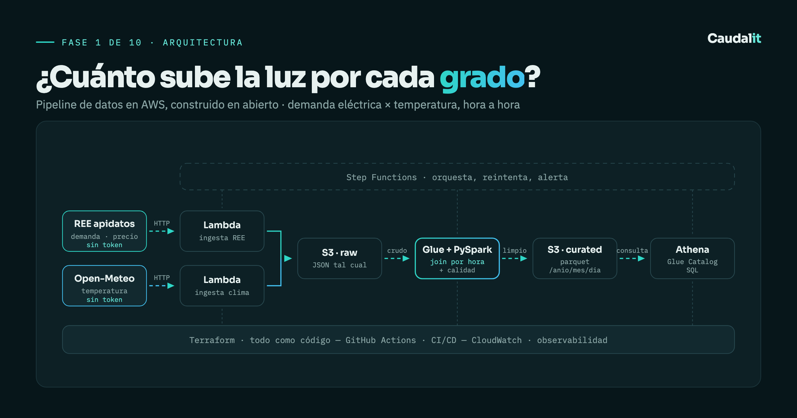

<p align="right"><a href="README.md">Español</a></p>

<h1 align="center">Degrees and Megawatts</h1>

<p align="center">
  <strong>An end-to-end data pipeline on AWS, built in the open.</strong><br>
  It joins Spanish electricity demand with temperature, hour by hour, to answer one specific question.
</p>

<p align="center">
  
  
  
  
  
</p>

---

> ### How much does peninsular electricity demand rise per degree of temperature, and at which hours is that energy most expensive?

The whole project exists to answer that. Every technical decision is justified by whether it gets closer to the answer.



---

## What this is

A data engineering project built **in public**, phase by phase, with the same standards used in production: infrastructure as code, data quality at the source, orchestration with retries, observability and cost under control.

It is not a tutorial or a notebook. It is a small but complete platform, plus the documentation of why it is built the way it is.

When it is finished, `terraform destroy` runs and the infrastructure disappears. **What remains as evidence is this repository**: the code, the diagrams and the decisions.

> **Note on language.** Phase documentation under [`docs/`](docs/) is written in Spanish, since the project is published as a Spanish-language series. The diagrams are largely self-explanatory, and this README covers the full scope and reasoning.

## Architecture

| Stage | Service | What it solves |
|---|---|---|
| Ingestion | **Lambda** (Python) | One function per source. Retries with backoff: the REE API fails intermittently. |
| Landing | **S3 · raw** | JSON exactly as received. Allows reprocessing without hitting the API again. |
| Transformation | **Glue + PySpark** | Flattening, validation, timezone normalisation and an hourly join of the three series. |
| Storage | **S3 · curated** | Parquet partitioned by `year/month/day`. |
| Catalog | **Glue Data Catalog** | Schema registration. |
| Query | **Athena** | SQL over the curated data. |
| Orchestration | **Step Functions** | Ordering, retries and alerts. |
| Observability | **CloudWatch** | Logs, metrics and alarms. |
| Infrastructure | **Terraform** | Everything as code, with remote state and locking. |
| CI/CD | **GitHub Actions** | `fmt` / `validate` / `plan` on every PR. |

Region: `eu-west-1` (Ireland).

## Data sources

Both **public and token-free**. Verified before anything was designed.

| Source | Endpoint | Data |
|---|---|---|
| Red Eléctrica (Spanish TSO) | `apidatos.ree.es/es/datos/demanda/evolucion` | Hourly peninsular demand |
| Red Eléctrica | `apidatos.ree.es/es/datos/mercados/precios-mercados-tiempo-real` | PVPC regulated and spot market price |
| Open-Meteo | `archive-api.open-meteo.com/v1/archive` | Hourly temperature (Madrid) |

> [!IMPORTANT]
> The demand endpoint **requires** `geo_trunc=electric_system&geo_limit=peninsular&geo_ids=8741`.
> Without those parameters it returns `400`.
>
> It also returns `400 "Error Interno"` **intermittently**, even for well-formed requests.
> That is why ingestion has retries by design rather than as a later patch.

**ESIOS was deliberately ruled out**: it offers the same data but requires a token that takes days to be granted. A source that blocks the start of a project has a real cost even when it is free.

## Status

| # | Phase | Status |
|:--:|---|:--:|
| 0 | Use case and dataset | Done |
| 1 | [Architecture](docs/fase-1-arquitectura/) | Done |
| 2 | [Repository and structure](docs/fase-2-repositorio/) | Done |
| 3 | Terraform: backend, S3, IAM, Glue DB, Athena | Pending |
| 4 | Ingestion: Lambdas with retries | Pending |
| 5 | Transformation: Glue + PySpark | Pending |
| 6 | Query: Athena | Pending |
| 7 | Orchestration: Step Functions | Pending |
| 8 | CI/CD: GitHub Actions | Pending |
| 9 | Final documentation | Pending |
| 10 | Teardown | Pending |

Every closed phase leaves a folder in [`docs/`](docs/) with its diagram, a PDF and the reasoning behind each decision.

Live status: **[caudalit.com/proyecto](https://caudalit.com/proyecto/)**

## Layout

```
.
├── terraform/
│   └── bootstrap/     remote state bucket (run once)
├── src/
│   ├── lambdas/       REE and Open-Meteo ingestion
│   └── glue/          PySpark jobs, raw → curated
├── athena/            queries answering the business question
└── docs/              one folder per phase: diagram, PDF and decisions
```

## Running it

> [!NOTE]
> Infrastructure arrives in **Phase 3**. Until then this repository holds the
> architecture and the decisions, not deployable resources.

Requirements: Terraform ≥ 1.10, AWS CLI configured, Python 3.12.

```bash
# 1. Create the remote state bucket (once)
cd terraform/bootstrap && terraform init && terraform apply

# 2. Deploy the rest
cd .. && terraform init && terraform plan
```

## Cost

The project is designed to fit within the AWS free tier, with one exception worth knowing about:

> [!WARNING]
> **AWS Glue has no free tier.** It bills per DPU-hour with a minimum per run.
> The real risk is a scheduled crawler or a job stuck in a loop.
>
> Mitigation: minimum DPUs, crawlers **on demand and never on a `schedule`**, a budget
> alert configured *before* creating any resource, and `terraform destroy` at the end of
> every test session.

S3, Lambda, Step Functions and Athena fit comfortably in the free tier at this volume (kilobytes per day).

## Technical decisions

Each phase documents what was decided and why in its `decisiones.md`. A summary of the ones that shape everything else:

- **Terraform state in S3 with locking**, never local. It is part of what the project sets out to demonstrate.
- **Step Functions instead of MWAA.** Managed Airflow costs hundreds of euros a month in fixed fees; with three steps it cannot be justified.
- **Raw and curated kept separate.** Untouched raw data is the insurance against a bug in the transformation logic.
- **Parquet partitioned by date.** Athena bills per TB scanned; partitioning turns a full scan into reading only what was asked for.
- **Two sources instead of one.** The hourly join is what separates a pipeline from a file copier.

---

<p align="center">
  <sub>
    <strong>Caudalit</strong> · Data engineering on AWS · Madrid, Spain<br>
    <a href="https://caudalit.com">caudalit.com</a> ·
    <a href="https://www.linkedin.com/in/georgebogdandinu/">LinkedIn</a>
  </sub>
</p>
